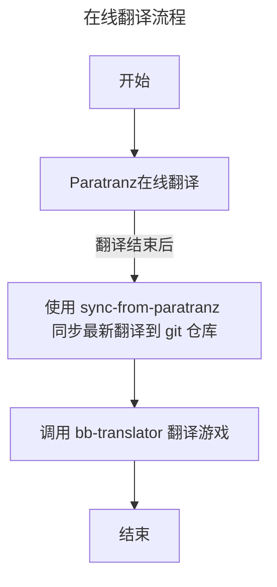
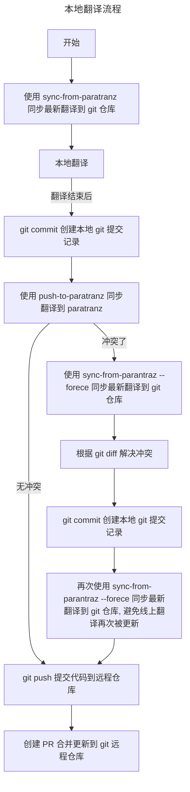

Battle Brothers(战场兄弟)中文翻译项目
<!-- ALL-CONTRIBUTORS-BADGE:START - Do not remove or modify this section -->
[](#contributors-)
<!-- ALL-CONTRIBUTORS-BADGE:END -->


## 贡献者 ✨

<!-- ALL-CONTRIBUTORS-LIST:START - Do not remove or modify this section -->
<!-- prettier-ignore-start -->
<!-- markdownlint-disable -->
<table>
  <tbody>
    <tr>
      <td align="center" valign="top" width="14.28%"><a href="https://blog.shabbywu.cn/"><br /><sub><b>shabbywu</b></sub></a><br /><a href="#" title="程序开发">💻</a> <a href="https://paratranz.cn/projects/7032" title="翻译">📚</a></td>
      <td align="center" valign="top" width="14.28%"><a href="https://github.com/Rayforward"><br /><sub><b>Rayforward</b></sub></a><br /><a href="https://paratranz.cn/projects/7032" title="翻译">📚</a></td>
      <td align="center" valign="top" width="14.28%"><a href="https://github.com/FaelGnahz"><br /><sub><b>FaelGnahz</b></sub></a><br /><a href="https://paratranz.cn/projects/7032" title="翻译">📚</a></td>
      <td align="center" valign="top" width="14.28%"><a href="https://github.com/poplar47"><br /><sub><b>poplar47</b></sub></a><br /><a href="https://paratranz.cn/projects/7032" title="翻译">📚</a></td>
      <td align="center" valign="top" width="14.28%"><a href="https://github.com/DarkSjm"><br /><sub><b>DarkSjm</b></sub></a><br /><a href="https://paratranz.cn/projects/7032" title="翻译">📚</a></td>
      <td align="center" valign="top" width="14.28%"><a href="https://github.com/YuanzhenW"><br /><sub><b>Yuanzhen Wu</b></sub></a><br /><a href="https://paratranz.cn/projects/7032" title="翻译">📚</a></td>
      <td align="center" valign="top" width="14.28%"><a href="https://github.com/zzj680124"><br /><sub><b>0v0</b></sub></a><br /><a href="https://paratranz.cn/projects/7032" title="翻译">📚</a></td>
    </tr>
    <tr>
      <td align="center" valign="top" width="14.28%"><a href="https://github.com/BarbChosen"><br /><sub><b>野蛮人神选者</b></sub></a><br /><a href="https://paratranz.cn/projects/7032" title="翻译">📚</a></td>
      <td align="center" valign="top" width="14.28%"><a href="https://github.com/1246291292"><br /><sub><b>1246291292</b></sub></a><br /><a href="https://paratranz.cn/projects/7032" title="翻译">📚</a></td>
      <td align="center" valign="top" width="14.28%"><a href="https://github.com/onesingleman"><br /><sub><b>onesingleman</b></sub></a><br /><a href="https://paratranz.cn/projects/7032" title="翻译">📚</a></td>
    </tr>
  </tbody>
  <tfoot>
    <tr>
      <td align="center" size="13px" colspan="7">
        
          <a href="https://all-contributors.js.org/docs/en/bot/usage">Add your contributions</a>
        </img>
      </td>
    </tr>
  </tfoot>
</table>

<!-- markdownlint-restore -->
<!-- prettier-ignore-end -->

<!-- ALL-CONTRIBUTORS-LIST:END -->


<a href="https://paratranz.cn/projects/7032">

</a>

重要说明
==========================================
> Q: 支不支持[传奇 Mod](https://github.com/Battle-Brothers-Legends/Legends-Bugs/releases)？   
> A: 这是游戏原版的汉化, 由于传奇 Mod 体量太大, 目前并未包含传奇 Mod 的文本。   

---
由于目前基本上是我个人在维护这个汉化，所以短期内并无计划开新坑。如果你希望有朝一日能用到全文本汉化的传奇 Mod, 可以通过点击右上角的 star 按钮或者直接参与原版文本的校对工作来减轻我的负担，这样说不定就有精力开新坑了😂


⭐️参与汉化的注意事项
==========================================
本项目的在线协同方式已迁移至 [paratranz](https://paratranz.cn/projects/7032), 目前参与汉化校对的途径有 2 种, 分别是 **在线翻译** 和 **本地翻译**, 建议优先通过 **在线翻译** 途径参与校对。

## 1. 在线翻译(推荐)
打开在线协同项目即可完成参与在线翻译, 翻译完毕后, 需要使用 `sync-from-paratranz` 同步回 git 仓库


> 注: sync-from-paratranz 不是必须操作, 本仓库会自动定时从 paratranz 同步翻译

## 2. 本地翻译

本地翻译即直接修改 git 仓库, 需要避免与在线协同项目的翻译产生冲突。翻译前, 建议使用 `sync-from-paratranz` 同步最新的翻译进度到 git 仓库。翻译后, 需要使用 `push-to-paratranz` 同步翻译进度到在线协同项目。
> 注: 本地翻译需要熟悉 git 工作流, 遇到冲突时参考流程图的指引尝试解决。   



> 注: 本地翻译后, 需要给本仓库创建 [Push Request](https://github.com/shabbywu/Battle-Brothers-CN/pulls), 只有 PR 合并后, 翻译才最终生效。


维护路线图
==========================================
- [x] 全文本基本翻译
- [x] 开发配套的汉化工具(bb-translator) 
- [x] 常用 Mod 适配(适配 Mod 需要使用 bb-translator 实时生成汉化)
  - [x] [modding script hooks](https://www.nexusmods.com/battlebrothers/mods/42)
  - [x] [招募显星(Smart Recruiter)](https://www.nexusmods.com/battlebrothers/mods/172)
  - ...
- [x] 大地图支持中文字符
- [ ] 文本精翻

使用说明
==========================================
1. 从 Release 中下载附件 **data_cn.zip** 与 **data_font.zip**
2. 将附件放置到游戏目录 data 下, 与游戏其他的 data_xxx.dat 文件放在同级目录，无需解压
3. 翻译不易, 走过路过右上角点个 star 可以吗？谢谢

---
⭐️ 汉化工具 - [bb-translator](https://github.com/shabbywu/bb-translator)
==========================================
[bb-translator](https://github.com/shabbywu/bb-translator) 是 Battle Brothers(战场兄弟) 的文本翻译器, 翻译器使用[本地化项目](https://github.com/shabbywu/Battle-Brothers-CN)的词条文件翻译 data 目录下的游戏脚本。

主要特性:
- 使用 physfs 读取文件, 实现了与游戏同样的加载方式和顺序
- 同时支持翻译 .nut/.cnut, 理论上支持翻译 Mod(只要 词条文件 中有对应的汉化文本)
- 可汉化历史版本的游戏脚本(只要 词条文件 中有对应的汉化文本)
- GUI 界面

## 使用说明
1. 从 [Release](https://github.com/shabbywu/Battle-Brothers-CN/releases) 下载最新版本的 bb-translator
2. 解压到游戏目录
3. 联网环境下执行

> Q: 为什么要联网?   
> A: 初次使用时, 需要联网初始化本地化项目 [Battle-Brothers-CN](https://github.com/shabbywu/Battle-Brothers-CN), 否则会因为缺失词条文件而无法使用。   
> 此外, 建议定期更新本地化项目，因为我们的汉化成员会不定期校对已翻译的文本。

⭐️ 协同工具 - push-to-paratranz/sync-from-paratranz
==========================================
`push-to-paratranz/sync-from-paratranz` 是从 ParaTranz 同步翻译进度的工具。

## 使用说明

1. 从 [Release](https://github.com/shabbywu/Battle-Brothers-CN/releases) 下载最新版本的 push-to-paratranz/sync-from-paratranz
2. 解压到游戏目录
3. 从 ParaTranz 获取 [API Token](https://paratranz.cn/users/my)
4. 联网环境下执行

```bash
示例: sync-from-paratranz

# 在控制台终端(cmd 或 powershell) 中执行
❯ sync-from-paratranz.exe --token ${YOUR-API-TOKEN} --project 7032
```
